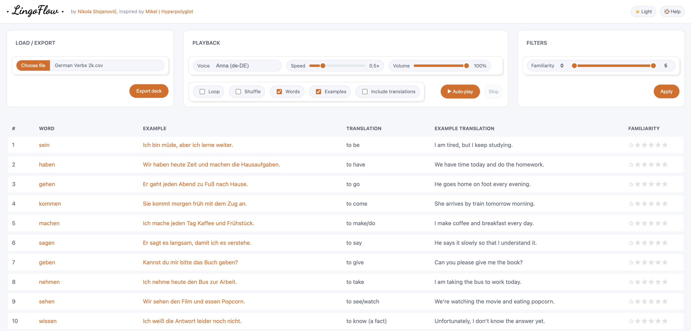

# LingoFlow

A zero-setup, offline-friendly CSV → audio player for language practice inspired by [Mikel | Hyperpolyglot's YouTube channel](https://www.youtube.com/@NaturalLanguageLearning).



Load a CSV of words/phrases + examples, then listen on loop with adjustable voice, speed, and volume. Click any item to hear it instantly, track familiarity with stars, filter by difficulty, and export your progress.

> Works entirely in the browser. No accounts, no servers. Does not require internet connection. Data is stored in `localStorage` and can be exported.

## ✨ Features

* **Light/Dark theme** toggle
* **Help overlay** (in-app guide with method tips)
* **Deck CSV import/export** (round-trip your deck, keep familiarity ratings)
* **Fine control** (voice selection, speed, volume)
* **Hands-free playback** (Auto-play, Loop, Shuffle)
* **Click-to-speak** (words & examples, optional translations)
* **Familiarity tracking** (0–5 stars per row, stored locally)
* **Filtering** (min/max familiarity range)
* **No backend** (static HTML/CSS/JS)
* **Privacy-first** (data never leaves your device)
* **Offline-friendly** (works without internet after initial load)

## 📁 Project structure

```
📁 lingo-flow
├── 📁 src               # LingoFlow source code
│   ├── 📁 resource
│   │   ├── 📁 css       # Contains CSS styles
│   │   └── 📁 js        # This is where all the logic is stored
│   └── index.html       # Main HTML file - this one should be opened in a browser
├── 📁 decks             # Contains deck CSV files
├── README.md            # This file
├── lingo-flow.png       # Screenshot image
├── LICENSE              # License information
├── CONTRIBUTING.md      # Contribution guidelines
├── CODE_OF_CONDUCT.md   # Code of conduct
└── .gitignore           # Specifies files for git to ignore
```

## 🚀 Getting started

1. **Clone** the repo or download the [latest release](https://github.com/Nikolichnik/lingo-flow/releases) ZIP archive.
2. Open the [main index file](src/index.html) directly in a modern browser. **That's it!**
3. If you'd like to, you can also run a tiny static server and host it locally:
   * Python: `python3 -m http.server 5173`
   * Node: `npx http-server -p 5173`
   * Access the the page at the appropriate address (e.g., `http://localhost:5173`).

> LingoFlow uses your browser’s built-in speech synthesis (Web Speech API). Available voices depend on your OS/browser.

## 🕹️ How to use

1. **Header**
    * Light/Dark toggle
    * Help: opens the in-app guide overlay.

2. **Load/Export panel**
    * Choose file: load a CSV deck. More info about the format in the dedicated [CSV format](#📄-csv-format) section.
    * Export Deck CSV: saves the current deck with your familiarity updates.

3. **Playback panel**
    * **Voice:** pick a system/browser voice.
    * **Speed:** adjust playback rate.
    * **Volume:** adjust loudness.
    * **Words + Examples** toggles: choose what gets spoken when auto-playing or clicking.
    * **Include translations:** speak translations right after the original.
    * **Loop/Shuffle:** keep it running; randomize order.
    * **Auto-play/Stop:** start/stop continuous playback.

4. **Filters panel**
   * **Familiarity range (0–5):** set min/max and Apply to filter visible/played rows.

5. **Table**
    * Click any Word or Example (blue links) to hear it immediately.
    * Click stars in the Familiarity column to rate from 0–5 (saved locally).

## 📄 CSV format

**Separator**
* In order to support rich examples, the CSV uses `|` (pipe) as the column separator instead of the more common comma. Commas can be used within fields without special handling.

**Required columns**
* `word` — the headword or phrase
* `example` — an example sentence

**Optional columns**
* `translation` — translation of `word`
* `example_translation` — translation of `example`
* `familiarity` — integer 0–5

Example:

```csv
word(s),example,translation,example_translation,familiarity
sein,Ich bin müde.,to be,I am tired.,2
haben,Wir haben Zeit.,to have,We have time.,1
gehen,Er geht nach Hause.,to go,He goes home.,0
```

Columns are matched by header name (case-insensitive, spaces/underscores tolerated).

## 💾 Persistence & privacy

* Familiarity ratings and some UI preferences are saved in `localStorage` on your device - they are never communicated over the network.
* Nothing is uploaded anywhere; audio is generated locally by your OS/browser.

## 🧩 Tips

* If you don’t see the expected voice, check your OS language packs and restart your browser.
* Speech quality and voice list vary by platform (e.g., macOS vs. Windows vs. ChromeOS).
* For long listening sessions, try Loop + Shuffle, and gradually increase Speed.
* Use Include translations when you want bilingual pass-through; turn it off for monolingual immersion.

## 🧪 Development

* Pure front-end: modify files in resources/css and resources/js.
* No build step required. Just refresh the page.
* Use your browser dev tools for console logs & profiling.

## 🧭 Roadmap ideas

* Per-row audio queue customization (order, delays)
* Auto-navigation to the row being played
* Hotkeys (next/prev row, toggle translate)
* Per-row notes and tags
* Multi-deck session manager
* Cloud import/export (Drive/Dropbox)
* RSS feed and the associated player for useful podcasts

## 🐛 Troubleshooting

* No sound: Check system volume and browser tab mute; verify a voice is selected.
* Voices list is empty: Some browsers delay voice loading—wait a second or reopen the Voice dropdown.
* Diacritics mispronounced: Try another voice/locale (e.g., Anna (de-DE) vs Martin (de-DE)).
* Deck CSV won’t load: Ensure required columns exist and the file is UTF-8 encoded.

## 🤝 Contributing

Contributions welcome! See [CONTRIBUTING.md](CONTRIBUTING.md) and our [Code of Conduct](CODE_OF_CONDUCT.md).

## 📝 License

Released under the [MIT License](LICENSE).